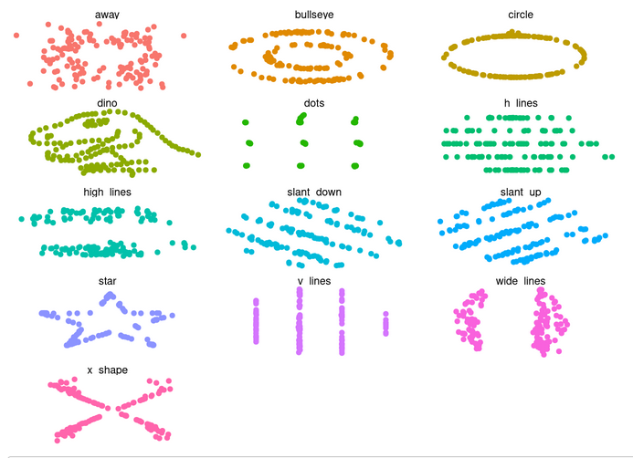
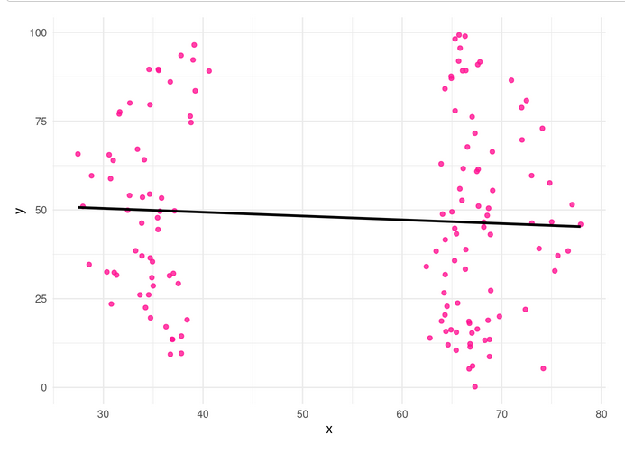
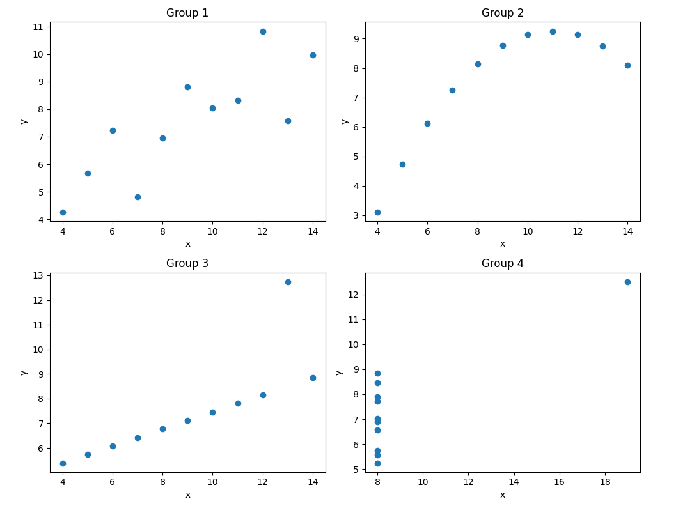
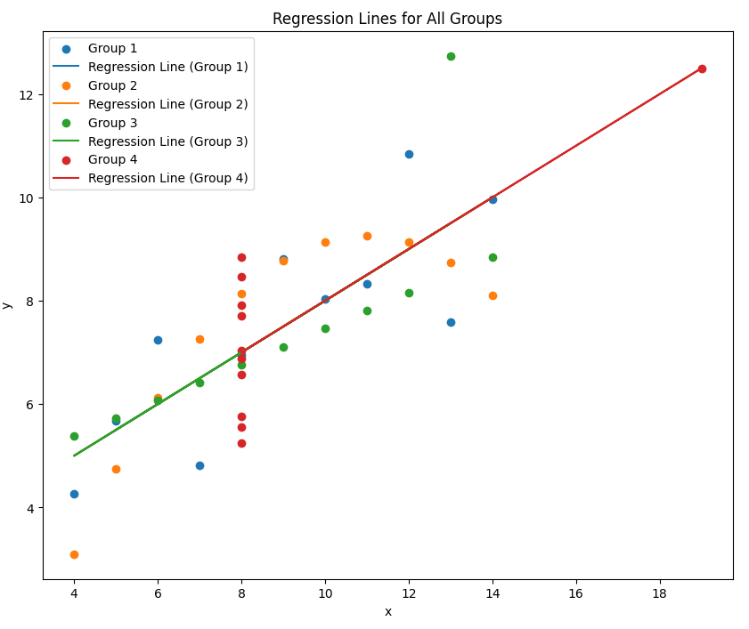

# Anscombe
## Universidad Politécnica Salesiana
## Período: 66
## Materia: Minería de Datos
## Estudiante: Samuel Pardo
El Cuarteto de Anscombe es un conjunto de cuatro conjuntos de datos ideados por el estadístico británico Francis Anscombe en 1973, cuyo objetivo principal fue mostrar la importancia de visualizar los datos antes de analizarlos exclusivamente con estadísticas resumidas. Cada uno de los cuatro conjuntos tiene estadísticas casi idénticas:

- Misma media y varianza para las variables x e y,
- Igual coeficiente de correlación,
- Misma línea de regresión lineal.

Sin embargo, su distribución visual es radicalmente diferente.
Esto demuestra que la estadística descriptiva por sí sola puede ser insuficiente para comprender la estructura real de los datos, y que los gráficos son fundamentales para un análisis completo.

## 📈 Ejemplo 

Como se observa, los cuatro gráficos tienen una tendencia estadística similar, pero su forma y comportamiento son notablemente distintos. Uno incluso presenta un patrón no lineal, otro tiene un valor atípico claro, y otro distribuye los puntos en línea recta.

## 📚 Referencia académica
- Anscombe, F. J. (1973). Graphs in Statistical Analysis. The American Statistician, 27(1), 17–21. https://doi.org/10.1080/00031305.1973.10478966

> [!NOTE]
> 🧠 Lección clave: El Cuarteto de Anscombe enseña una lección crucial en estadística y ciencia de datos:
> - **"Siempre visualiza tus datos."**

## Actividad 1
En esta actividad se trabajo con el dataset datasaurus_dozen, un conjunto que pertenece al paquete datasauRus en R. Este conjunto contiene varios subconjuntos de datos que, aunque tienen estadísticas similares (como media, desviación estándar y correlación), muestran patrones visuales muy distintos cuando se grafican.

Luego se realizó la filtración específicamente el subconjunto wide_lines, que se caracteriza por tener una dispersión horizontal amplia. Luego:
- Visualización de los puntos con ggplot2.
- Aplicación de un modelo de regresión lineal (lm) para observar la relación entre las variables x / y.
- Línea de regresión al gráfico, lo cual permite visualizar la tendencia lineal entre ambas variables.

Esto ilustra cómo, incluso con un patrón de dispersión no evidente a simple vista, el modelo puede encontrar y representar relaciones lineales.

## Actividad 2

En la segunda actividad se trabajo con el dataset Anscombe y la herramienta utilizada fue LinearRegression

Carga de datos: df_anscombe.csv
Preparación del modelo:

- Se dividieron los datos en variables independientes (X) y dependientes (y).
- Se creó una instancia del modelo LinearRegression.
- Se entrenó el modelo con fit(X, y).

Predicción:
- Se usó model.predict(X) para generar predicciones con los datos de entrada.

Visualización:
- Se graficaron los puntos reales (scatter plot) y la línea de regresión generada.
- Esto permite comparar visualmente cómo el modelo se ajusta a los datos.

Evaluación:
- Posiblemente se mostraron métricas como la pendiente, el intercepto y el coeficiente de determinación R2R2.

